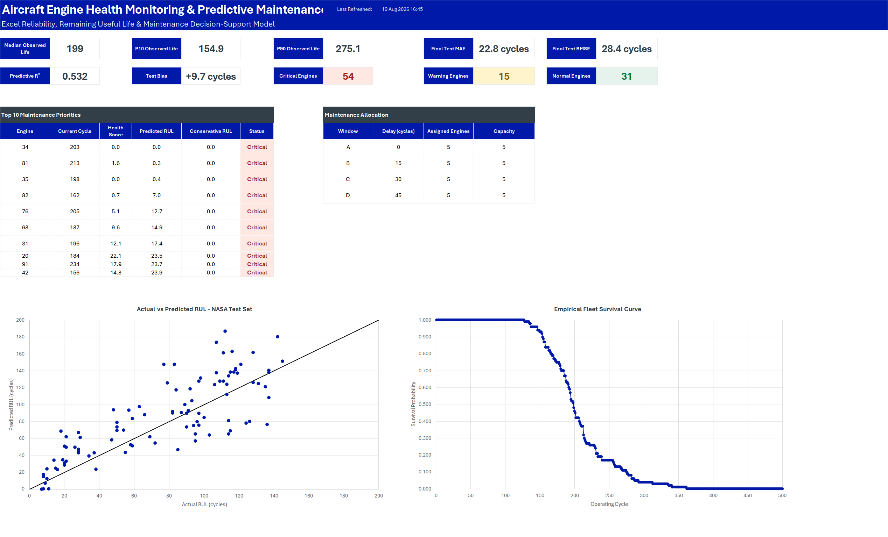
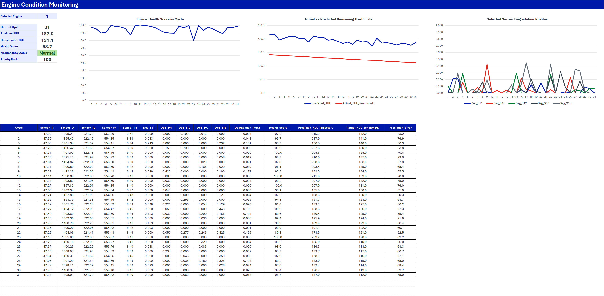
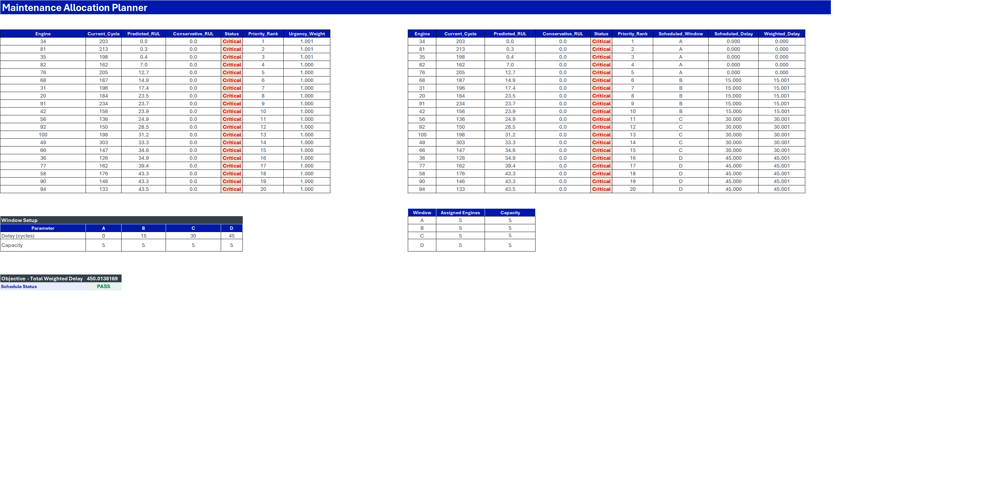
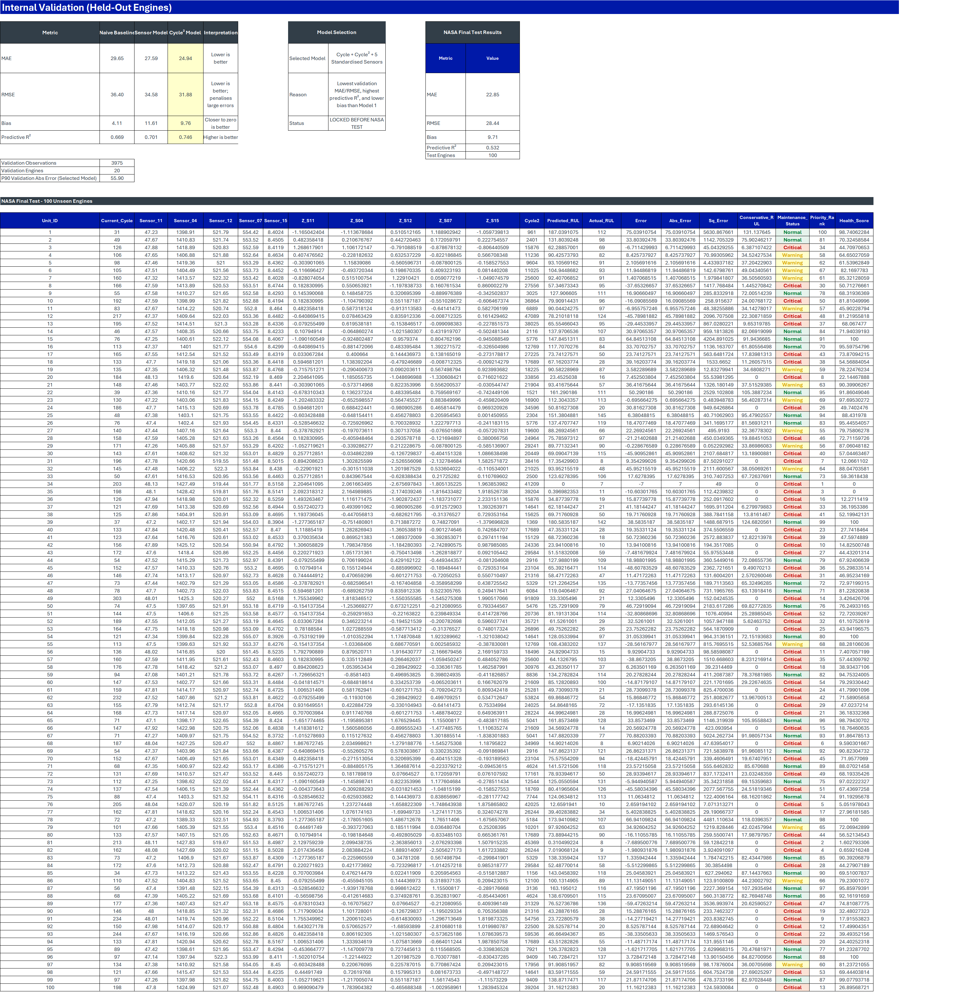

# Aircraft Engine Health Monitoring & Predictive Maintenance

An Excel reliability and predictive-maintenance project using the NASA C-MAPSS FD001 turbofan degradation dataset. The workbook combines Power Query, Power Pivot / DAX, reliability analysis, sensor-based health scoring, interpretable Remaining Useful Life (RUL) modelling, empirical prediction uncertainty and Solver-based maintenance scheduling.



**Quick review:** [3-page project summary](docs/Aircraft_Engine_Project_Summary.pdf) · [Excel portfolio workbook](workbook/Aircraft_Engine_Predictive_Maintenance_Portfolio.xlsx)

## Project goal

The project was built to show Excel as a complete reliability and maintenance decision-support stack rather than only a reporting tool.

The workbook answers five practical questions:

1. What does fleet lifetime reliability look like across complete run-to-failure engines?
2. Which sensor channels show the clearest degradation signal?
3. How accurately can Remaining Useful Life be estimated for unseen engines?
4. Which engines require maintenance attention after accounting for prediction uncertainty?
5. How should the highest-priority engines be allocated across constrained maintenance windows?

## Headline results

- **100 run-to-failure training engines and 100 unseen test engines** are modelled from NASA C-MAPSS FD001.
- The training fleet has a **median observed life of 199 cycles**, with **P10 = 154.9** and **P90 = 275.1 cycles**.
- Sensor screening selected **Sensor_11, Sensor_04, Sensor_12, Sensor_07 and Sensor_15** using Development-engine variability, correlation and degradation-shift evidence.
- The selected interpretable RUL model uses **Cycle + Cycle² + five standardised sensors**.
- On the held-out validation engines, the selected model achieved approximately **24.94 MAE**, **31.88 RMSE** and **0.746 predictive R²**.
- After the specification was locked and refitted on all training engines, the genuine NASA test set produced **22.85 MAE**, **28.44 RMSE**, **+9.71-cycle bias** and **0.532 predictive R²** across 100 unseen engines.
- The **90th-percentile validation absolute error is 55.90 cycles** and is used as an empirical error band to create Conservative RUL. It is not presented as a statistical confidence interval.
- In the cached current-fleet view, the maintenance logic classifies **54 engines as Critical, 15 as Warning and 31 as Normal** under the portfolio thresholds.
- Solver allocates the **20 highest-priority engines across four maintenance windows**, with five engines per window and every selected engine assigned exactly once.

## Workbook walkthrough

### Executive Dashboard

Summarises fleet reliability, final NASA test performance, maintenance status counts, top maintenance priorities and constrained maintenance allocation.


### Engine Detail

Provides an interactive engine selector with current cycle, predicted RUL, Conservative RUL, Health Score, maintenance status, priority rank and full sensor / health / RUL trajectories.



### Maintenance Planner

Ranks the highest-risk engines and uses Excel Solver binary decision variables to allocate them across maintenance windows subject to capacity constraints.



### Model Validation

Compares the naive baseline, sensor model and Cycle² model on held-out engines before the final model is locked and evaluated on the NASA test set.



## Data source

The project uses the **NASA C-MAPSS Turbofan Engine Degradation Simulation Data Set**, subset **FD001**.

FD001 contains 100 training trajectories and 100 test trajectories under one operating condition and one fault mode. Training trajectories run to failure; test trajectories stop before failure and are supplied with final Remaining Useful Life targets.

Official source:

- NASA Prognostics Center of Excellence Data Set Repository: https://www.nasa.gov/intelligent-systems-division/discovery-and-systems-health/pcoe/pcoe-data-set-repository/
- NASA Open Data — CMAPSS Jet Engine Simulated Data: https://data.nasa.gov/dataset/cmapss-jet-engine-simulated-data

Data set citation:

> A. Saxena and K. Goebel (2008), *Turbofan Engine Degradation Simulation Data Set*, NASA Prognostics Data Repository, NASA Ames Research Center, Moffett Field, CA.

See [Data Sources](docs/DATA_SOURCES.md) for file structure and refresh notes.

## Methodology

### Power Query

Power Query is used to ingest and structure the FD001 training, test and test-RUL source files. The query layer creates engine-level maximum-cycle fields, row-level true training RUL, Development / Validation engine labels and latest-observation flags for the test fleet.

### Leakage-safe development and validation

The 100 training engines are split at **engine level** into **80 Development engines and 20 Validation engines**. Sensor screening, healthy / late-life reference values, standardisation parameters and model selection are developed without using the held-out Validation engines for fitting.

### Sensor screening and Health Score

All 21 sensors are profiled. The final five sensors are selected from Development data only. Each selected sensor is normalised between Development-fleet healthy and late-life reference values, clamped to a 0–1 degradation scale and equally weighted.

```text
Health Score = 100 × (1 − mean selected-sensor degradation)
```

### RUL modelling

The modelling progression is deliberately interpretable:

1. Naive baseline: Development mean failure cycle minus current cycle.
2. Cycle + five standardised selected sensors.
3. Cycle + Cycle² + five standardised selected sensors.
4. Lock the winning specification before NASA test evaluation.
5. Refit the locked specification on all 100 training engines.

The final regression is:

```text
Predicted RUL = Intercept
              + β1 × Cycle
              + β2 × Cycle²
              + β3 × Z(Sensor_11)
              + β4 × Z(Sensor_04)
              + β5 × Z(Sensor_12)
              + β6 × Z(Sensor_07)
              + β7 × Z(Sensor_15)
```

See [Formula & Query Guide](docs/FORMULA_GUIDE.md) for coefficients, formulas, DAX measures and Power Query logic.

### Prediction uncertainty and maintenance logic

The workbook uses the **90th percentile of held-out validation absolute errors** as a transparent empirical error allowance:

```text
Conservative RUL = MAX(0, Predicted RUL − P90 Validation Absolute Error)
```

Portfolio maintenance thresholds are then applied to Conservative RUL:

- **Critical:** ≤ 30 cycles
- **Warning:** > 30 and ≤ 60 cycles
- **Normal:** > 60 cycles

These thresholds are portfolio-model assumptions for demonstration and are **not aviation maintenance limits or approved airworthiness criteria**.

### Solver maintenance scheduling

The 20 highest-priority engines are assigned to four maintenance windows:

| Window | Delay | Capacity |
|---|---:|---:|
| A | 0 cycles | 5 engines |
| B | 15 cycles | 5 engines |
| C | 30 cycles | 5 engines |
| D | 45 cycles | 5 engines |

Solver minimises urgency-weighted maintenance delay subject to binary assignment, one assignment per engine and window-capacity constraints.

## Workbook architecture

| Layer | Workbook implementation |
|---|---|
| **Guide / executive output** | `Start_Here`, `Dashboard` |
| **Decision-support tools** | `Engine_Detail`, `Maintenance_Planner` |
| **Documentation / assumptions** | `Methodology`, `Inputs` |
| **Audit and analytical outputs** | `Data_Quality`, `Reliability`, `Sensor_Profile`, `Engine_Summary`, `RUL_Model`, `Validation` |
| **Model calculation layer** | `Model_Data` |
| **Power Query output** | `PQ_Train`, `PQ_Test` |
| **Raw source layer** | `Raw_Train`, `Raw_Test`, `Raw_Test_RUL` |

The Power Pivot model contains a one-to-many relationship from the training-engine table to the row-level training model table. The current NASA test fleet is intentionally kept as a separate disconnected table because test Engine 1 is not the same physical engine as training Engine 1.

See [Workbook Architecture](docs/WORKBOOK_ARCHITECTURE.md) for the full model map.

## How to use the workbook

1. Open the cached portfolio workbook in **Microsoft 365 desktop Excel**.
2. Start from `Start_Here` and then open the `Dashboard`.
3. Use `Engine_Detail` to inspect individual unseen engines.
4. Use `Maintenance_Planner` to review the constrained maintenance schedule.
5. Do **not** refresh unless you also have the NASA FD001 source files and have updated the local data-folder path on `Inputs`.

The cached workbook can be reviewed without the raw NASA source files. A full refresh requires Power Query access to the local FD001 files. Solver is required only if the maintenance allocation is re-optimised.

## Files in this repository

- [`docs/Aircraft_Engine_Project_Summary.pdf`](docs/Aircraft_Engine_Project_Summary.pdf) — concise 3-page portfolio summary
- [`workbook/Aircraft_Engine_Predictive_Maintenance_Portfolio.xlsx`](workbook/Aircraft_Engine_Predictive_Maintenance_Portfolio.xlsx) — cached reviewer workbook
- [`docs/FORMULA_GUIDE.md`](docs/FORMULA_GUIDE.md) — important Excel formulas, model coefficients, DAX measures and Power Query patterns
- [`docs/WORKBOOK_ARCHITECTURE.md`](docs/WORKBOOK_ARCHITECTURE.md) — workbook layers, tables and model flow
- [`docs/DATA_SOURCES.md`](docs/DATA_SOURCES.md) — NASA source register and refresh notes
- [`assets/`](assets/) — screenshots of the finished workbook

## Data quality and limitations

- The workbook contains **25 automated data-quality checks**, all passing in the cached portfolio build.
- FD001 contains one operating condition and one fault mode; conclusions should not be generalised to more complex C-MAPSS subsets without further modelling.
- C-MAPSS cycles are simulated operational cycles rather than flight hours.
- Health Score is a project-defined analytical indicator, not a certified engine-health metric.
- The RUL regression is intentionally interpretable and does not attempt to reproduce state-of-the-art deep-learning prognostics.
- Final NASA test bias is positive, so predicted RUL is optimistic on average; the Conservative RUL layer is included to expose this uncertainty in maintenance decisions.
- The P90 validation absolute-error allowance is an empirical validation error band, not a 90% statistical confidence interval.
- Maintenance thresholds, uncertainty adjustments, capacities and Solver urgency weights are portfolio assumptions rather than approved aviation maintenance rules.

## Tools demonstrated

**Excel · Power Query · Power Pivot · DAX · Dynamic Arrays · Reliability Analysis · Regression · Validation Design · Predictive Maintenance · Solver Optimisation · Data Quality Controls · Decision-Support Modelling**

Data provided by NASA Ames Prognostics Center of Excellence / NASA Open Data.
